# SIG-Release

Welcome to SIG-Release, home of release and feature management.

## The planning and roadmap process

We follow a coordinated approach to plan improvements of Eclipse Tractus-X.

While every repository in the [eclipse-tractusx](https://github.com/eclipse-tractusx) GitHub organization
has its own issue management, the [release planning board](https://github.com/orgs/eclipse-tractusx/projects/26)
is used to align the overarching Tractus-X releases.

### How can I get involved

In case you experienced a bug, unexpected behaviour, or you want to propose enhancements to Eclipse Tractus-X,
feel free to use on of the provided [issue templates](https://github.com/eclipse-tractusx/sig-project-management/issues/new/choose) and describe your request.
Please be aware, that not every feature request can be integrated and that we also cannot treat every issue with the highest priority.

Every Release planning will be kicked off by two public alignment sessions. The dates and further details will be shared via
[tractusx-dev](https://accounts.eclipse.org/mailing-list/tractusx-dev) mailing list.
Issues or bug reports, that should be discussed in these meetings, have to be opened prior to the meeting via
our [issue templates](https://github.com/eclipse-tractusx/sig-project-management/issues/new/choose).

### What can I expect

We really welcome every contribution. Every Bug report and feature proposal takes time to prepare,
is valuable to our project and we very much appreciate this input.
We are giving our best to give a first feedback in one week.
If we should miss that, please stick with us and just use the commenting function to remind us of the issue.

### Issue structure

Our issues do have important properties, that enable our planning process. These are:

- __Labels:__ We use them to indicate the involved teams. A label for each involved component is added to an issue
- __Issue Type:__ To separate between bugs and feature request, we use a custom field `Issue Type`
- __Milestone:__ Every Tractus-X release is represented by a `Milestone`. You can use this field to get a rough idea about the ETA
- __Status:__ The status field is used to integrate the progress of an issue
- __Iteration:__ `Milestone`s are divided in multiple iterations. The 'Iteration' field is used to do finegrained timeline planning

### Issue statuses

The following statuses are defined:

- __Inbox:__ This is the initial status of all issues. It indicates, that involved components have to be identified and additional information gathered
- __Backlog:__ If enough information is gathered and we agreed to work on the issue, it is set from `Inbox` to `Backlog` to indicate it is ready for timeline planning
- __Work in Progress:__ The issue is actively been worked on.
- __Done:__ All relevant parts have been implemented and released

### Issue process

Every new feature proposal or bug report will be handled as issue in status `Inbox` initially. The alignment meetings are used to discuss the purpose and impact of the current issues.
While in `Inbox` status, the involved components are discovered and respective `Labels` are added. If already possible, a desired `Milestone` can be set.
Additionally an `Assignee` is selected, who will coordinate efforts to solve the issue.

After these details are clarified, an issue is moved to `Backlog` to open it for detailed timeline planning. In this status, discussions about a fitting `Iteration` is held.

As soon as actual work is started in the selecte iteration, the issue is set to `Work in Progress`. This is especially helpful on our project milestone views to get an overview of the release progress.

The final status `Done` is set, as soon as all relevant implementations are done, tested and released. This has to be achieved for every change in every involved component.

### Planning component changes

While the [Release Planning Board](https://github.com/orgs/eclipse-tractusx/projects/26) is used to coordinate overarching feature and bug request,
we encourage every component team to break these issues down to their component repositories/projects.
When doing so, make sure you link to the overarching issue in your component issue description.

## Release Management Acceptance Criteria
The release participation can be initiated by creating issues for the acceptance criteria check from the Issue templates.
Each release the Templates for the acceptance criteria will be renewed. There are two Paths for processing the acceptance criteria for an application team to participate in a release.

### The Release Happy Path for the Acceptance Criteria
The three process steps to get to the status you need to pass the Q-Gate are shown in the happy path process flow.

Each acceptance criteria issue in GitHub contains a note with the prime contacts so that it is clear who is the assigned expert or release manager.

### The other Release Path
If the evidence is not sufficient so that the criterium can not be accepted in the quality gate (QG), obligations for the product team will be defined to make a reassessment.

## Contact

- [Mailing List](https://accounts.eclipse.org/mailing-list/tractusx-dev)
