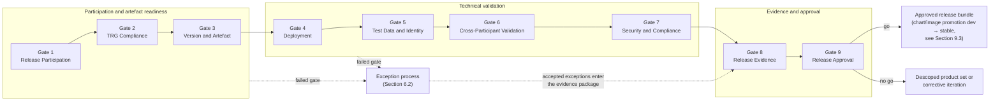
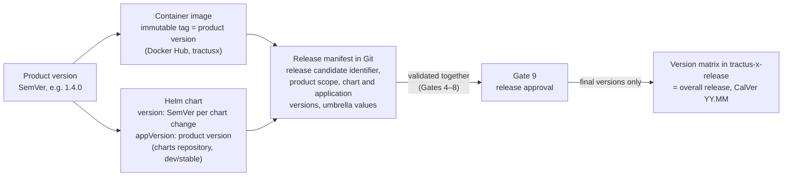
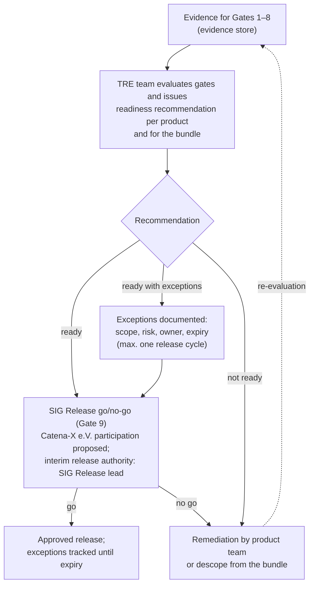
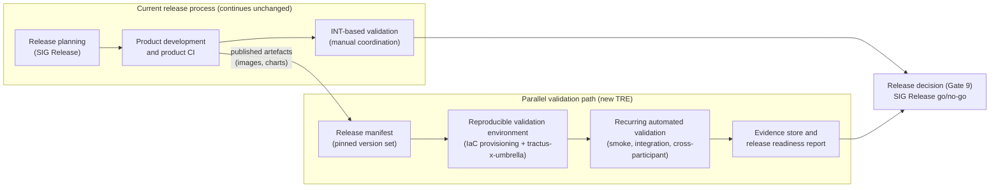
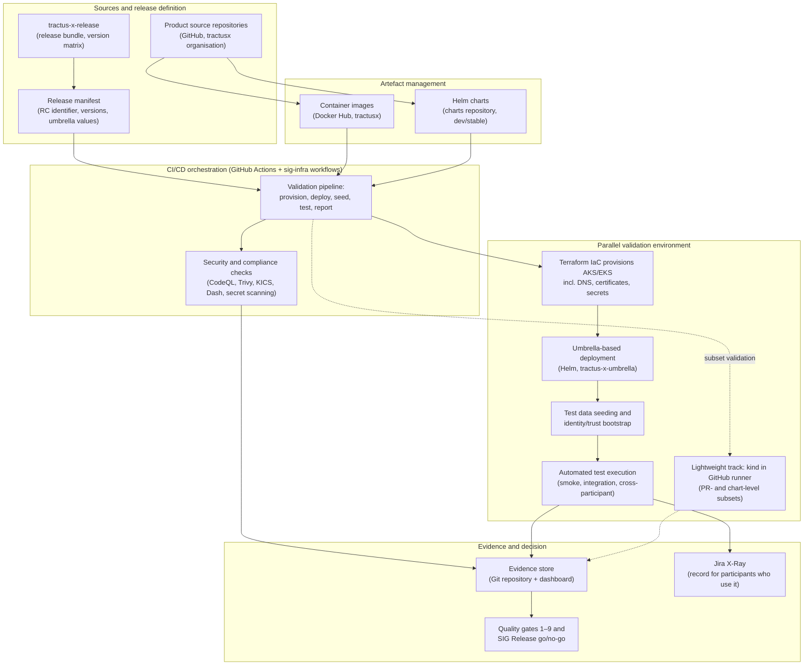
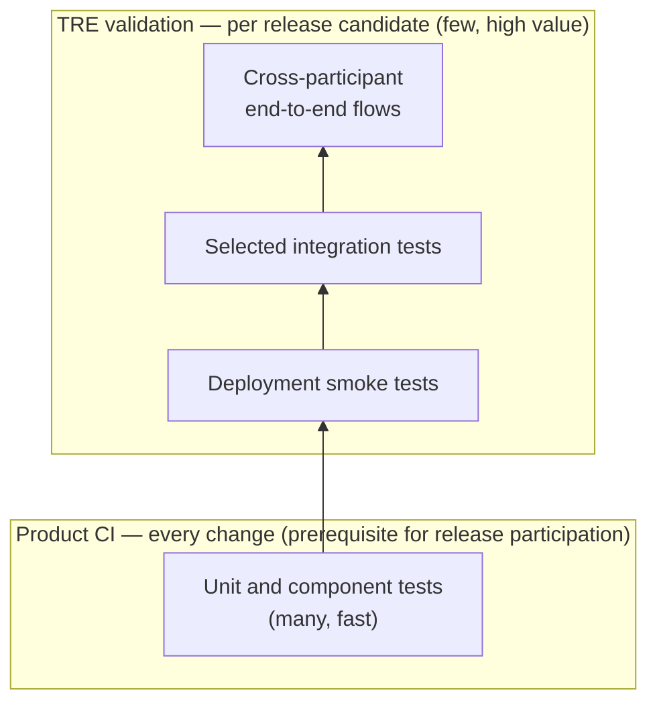
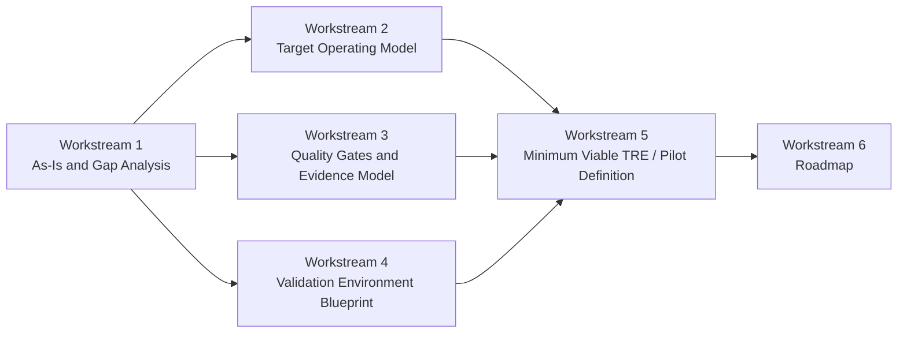

# Technical Release Engineering

## Status

This document is a **concept proposal** for a Technical Release Engineering (TRE) capability for Eclipse Tractus-X. It complements the existing release process described in [planning.md](planning.md), [product_release.md](product_release.md) and [tractus-x-release.md](tractus-x-release.md); it does not change it.

Items marked *provisional* are proposals that require confirmation by SIG Release and the affected stakeholders before they become binding. Open decisions are collected in Section 13.4.

Intended readers: product owners, release management, platform and infrastructure teams, quality coordination, security and compliance, and anyone involved in Tractus-X release readiness.

---

## 1. Motivation and Objective

### 1.1 Summary

This document proposes a Technical Release Engineering (TRE) concept for Tractus-X. The aim is a practical release engineering model that improves release quality, traceability and reproducibility while preserving the current release process during the pilot phase.

Tractus-X already has a formal release cadence, SIG Release governance, release checks, test management, a central Helm chart repository, an overarching release repository and the `tractus-x-umbrella` deployment baseline. What is not yet in place is a technical layer that makes release validation reproducible end to end. Today, validation depends largely on manual coordination, on a shared environment that drifts between releases, on automation whose maturity differs per product, on evidence spread across several systems, and on ownership that is not always explicit across organisational boundaries.

The proposed TRE concept complements the current process with a cross-cutting release engineering capability based on:

- a parallel validation environment running alongside the current process,
- reproducible provisioning from scratch,
- explicit reuse of `tractus-x-umbrella` for deployment topology and version pinning,
- alignment with the release bundle defined in `tractus-x-release`,
- automated deployment of selected subsets via Helm,
- realistic dataspace test data and identity bootstrap,
- recurring validation runs with a clear trigger model,
- central publication of evidence,
- evidence-based quality gates,
- explicit governance guidelines for versioning, approval and quality assurance,
- a reuse-first toolchain recommendation including security and compliance checks,
- and clear ownership for environment, validation, approval and continuous improvement.

The recommendation is not to replace the current process immediately. That process validates releases in the shared integration environment referred to as **INT** throughout this document. The preferred approach is to build trust incrementally through a **parallel validation environment** that validates the concept, demonstrates measurable benefit and gradually reduces manual effort.

### 1.2 Objective

| **Objective** | Establish an engineering-driven release model for Tractus-X that improves release quality, traceability and reproducibility without interrupting the existing release flow. |
|----------|----------------------------------------------------------------------------------------------------------------------------------------------------------------|

The concept addresses the following questions:

- How can a Tractus-X release be validated in a more reproducible way?
- How can existing assets such as `tractus-x-umbrella`, `sig-release`, `tractus-x-release`, `charts` and `sig-infra` be reused instead of duplicated?
- How can manual effort in testing, tracking and release coordination be reduced?
- How can TRGs, release checks, test management and release bundles be integrated into one coherent technical model?
- Which toolchain (CI/CD, artefact management, security checks) should the TRE build on?
- How can parallel validation be introduced without breaking the current process?
- How is clear ownership defined for environment, tests, gates, evidence and approval?

The working assumptions the concept rests on are listed in Section 13.3.

---

## 2. Current State Analysis

### 2.1 Current Situation

Tractus-X operates with quarterly releases and formal phases for planning, refinement, development, testing and release approval. The release planning board organises the work through views such as:

- Timeline
- Open Planning
- Topics/Products
- Release Management
- Test Management

This shows that Tractus-X already has governance and planning structures in place. The problem is not the absence of a process, but the missing technical layer for sufficiently automated, reproducible and decision-ready validation.

At the same time, Tractus-X already provides several important assets that are relevant for TRE:

- `tractus-x-umbrella` for umbrella deployment, sandboxing and E2E-oriented setup,
- `tractus-x-release` for the overarching release bundle and compatible version matrix,
- `charts` for `dev` and `stable` Helm chart distribution,
- `sig-release` for release governance and quality gate flow,
- `sig-release/release-automation` for TRG checks,
- `sig-infra` for reusable workflows and quality automation.

This section is a preliminary assessment based on the publicly documented release process and on analysis of the repositories listed above. A systematic as-is study together with SIG Release and the product teams is still needed; it is the first step proposed in Section 12.

### 2.2 Existing Guidelines and Constraints

Products participating in a Tractus-X release must comply with the TRGs. These rules already define important requirements, for example:

- Kubernetes as runtime target
- Packaging as container image
- Deployment via Helm chart
- Release artefact management
- Open source governance
- Security requirements
- Release documentation

The new TRE does not redefine these rules. It uses them as the baseline for quality gates and release readiness. Where possible, it should also reuse existing automation from `sig-release/release-automation` and `sig-infra` instead of modeling TRG compliance as a purely manual checkpoint.

### 2.3 Current Testing Situation

The current testing situation combines automated and manual practices:

- release participants coordinated through the Catena-X consortium record test results in Jira X-Ray,
- some teams run automated tests in GitHub Actions and publish results to X-Ray,
- some teams execute part of their tests manually,
- the degree of automation varies by product,
- there is no consistent full-stack automation from infrastructure to test execution,
- the current environment model relies on INT and on expert-driven setup.

X-Ray is licensed tooling operated in the Catena-X context and is not available to every Eclipse Tractus-X contributor. Any TRE evidence model therefore has to work for both groups; this constraint is addressed in Sections 6.4 and 9.5.

In addition, the existing `tractus-x-umbrella` repository already provides a deployable data-exchange baseline with multi-participant elements, test data seeding and identity/trust-related setup. This means a large part of the validation topology already exists, but it is not yet formalised as a TRE operating model.

### 2.4 Identified Gaps

| Gap | Impact | Criticality |
|-----|--------|-------------|
| Drifted INT environment | Unreliable testing basis, expensive reinitialisation, poor reproducibility | High |
| No full-stack automation | High dependency on expert knowledge, low repeatability | High |
| Insufficiently enforced technical quality gates | Release decisions still rely heavily on manual coordination | High |
| Fragmented ownership | Responsibility gaps for environments, evidence and exceptions | High |
| Missing explicit release input contract | It is unclear exactly which version set has been validated | High |
| Under-specified dataspace validation | A single deployment does not prove cross-participant interoperability | High |
| Test data and identity bootstrap not yet formalised | The hardest prerequisite of real dataspace validation remains unspecified | High |
| Missing systematic upstream feedback from downstream QA | Quality learnings are not consistently integrated into Tractus-X | Medium |
| Release validation scoped as test management only | The software-engineering perspective on release validation is not covered | High |

---

## 3. Scope Definition

### 3.1 In Scope

Technical Release Engineering for Tractus-X includes:

- release readiness integration with the existing planning and release process,
- reuse and extension of existing assets such as `tractus-x-umbrella`, `tractus-x-release`, `sig-release`, `sig-infra` and `charts`,
- reproducible build, packaging and deployment prerequisites,
- validation against an explicitly pinned release version set,
- continuous technical validation in a controlled parallel environment,
- multi-participant dataspace validation as default pilot scope,
- quality gates with minimum evidence,
- release governance guidelines for versioning, approval and quality assurance,
- a reuse-first toolchain recommendation covering CI/CD, artefact management and security checks,
- technical reporting and traceability,
- explicit ownership for validation, approval and exceptions,
- a pilot-oriented rollout approach for the target model.

### 3.2 Out of Scope

This concept does not cover:

- full implementation of the target environment,
- migration of all products at once,
- replacement of the current INT-based process,
- operation of the environment in production,
- final confirmation of every tool decision (Section 9 provides the recommendation with rationale; confirmation follows stakeholder validation),
- automation of all tests across all participating products.

---

## 4. Target Concept and Operating Model

### 4.1 Target Vision

The new TRE turns release engineering for Tractus-X into a cross-cutting technical capability.

> Establish a reproducible, automated and evidence-based release engineering model that complements the current Tractus-X process with parallel validation, reusable deployment assets and standardised quality gates.

This model should enable:

- earlier and more frequent validation of components,
- reduced human drift in environments,
- reproducible deployment of components,
- execution of a minimum set of automated tests,
- explicit validation of cross-participant dataspace flows,
- publication of traceable results,
- release decisions based on technical evidence.

### 4.2 Target TRE Model

The new TRE is structured into seven main capabilities:

#### Release Planning Integration

TRE integrates with the existing Tractus-X release planning process and ensures that:

- products explicitly declare release participation,
- dependencies are identified early,
- technical prerequisites are visible,
- readiness is not assessed only at the end of the cycle.

#### Release Manifest and Version-Set Control

TRE validates against a pinned release candidate input set:

- release candidate identifier,
- selected product scope,
- chart versions,
- application versions,
- umbrella values or equivalent release manifest,
- traceable source for the validated bundle.

This input should be aligned with `tractus-x-release` and `charts`, and should use umbrella configuration as code where applicable.

#### Build and Packaging Readiness

Each participating product must provide releasable and traceable artefacts:

- reproducible build,
- traceable version,
- available container image,
- available Helm chart,
- published artefacts,
- compliance with relevant TRGs.

#### Automated Deployment Readiness

Each pilot product must be deployable through standardised procedures:

- deployment via Helm,
- externalised configuration,
- declared dependencies,
- manageable secrets and certificates,
- deployability into the selected validation environment,
- compatibility with umbrella-based deployment composition.

#### Parallel Validation

TRE introduces validation in parallel:

- automated smoke tests,
- selected integration tests,
- at least one multi-participant data-exchange scenario,
- automated test data and identity bootstrap,
- recurring execution by explicit trigger model,
- visible and traceable results.

#### Evidence and Reporting

Technical evidence must exist for:

- what was built,
- which version set was validated,
- which charts and components were deployed,
- which tests were executed,
- what failed,
- what was accepted as risk,
- which product fulfils the gates.

#### Governance and Approval

Approval must be:

- explicit,
- traceable,
- evidence-based,
- supported by formal exception handling,
- connected to the real release decision process.

### 4.3 Roles and Ownership

| Role | Responsibility |
| --- | --- |
| Product Team | Deliver releasable artefacts, Helm chart, configuration and product-specific tests |
| Technical Release Engineering Team | Define the TRE model, gates, evidence, reporting and technical orchestration |
| Platform / Infrastructure Team | Provide cluster setup, networking, certificates and baseline environment capabilities |
| Test / Quality Coordination | Define minimum test scope, coordinate evidence and ensure testing traceability |
| Security / Compliance | Define security checks, open source compliance and exception criteria |
| SIG Release / Release Governance | Review release readiness, consume evidence and coordinate go/no-go decisions |
| Release Authority | Approval model proposed in Section 6.2, to be confirmed with stakeholders |
| Topic / Product Representatives | Coordinate cross-product dependencies and readiness by domain |

A detailed RACI is the next step after concept validation. One explicit governance question remains open: who has real authority to require product-team participation across companies.

---

## 5. Quality Gates and Evidence Model

### 5.1 Proposed Quality Gates

#### Gate 1: Release Participation Gate

The product confirms release participation and defines scope, owner and pilot responsibilities.

#### Gate 2: TRG Compliance Gate

The product fulfils the relevant TRGs for release, including container, Helm, Kubernetes, artefacts, security and open source governance.

#### Gate 3: Version and Artefact Gate

The build is reproducible, the required artefacts are published and the validated version set is explicitly pinned.

#### Gate 4: Deployment Gate

The selected bundle can be deployed automatically into the defined validation environment.

#### Gate 5: Dataspace Test Data and Identity Gate

Required participants, identity/trust prerequisites, credentials and test data can be loaded or generated in a controlled way.

#### Gate 6: Automated Cross-Participant Validation Gate

The defined minimum smoke and integration scenarios are executed and generate traceable results.

#### Gate 7: Security and Compliance Gate

No critical findings remain open, or exceptions are documented and accepted. This includes the security of the validation environment itself.

#### Gate 8: Release Evidence Gate

The required evidence package is complete and reviewable by release stakeholders.

#### Gate 9: Release Approval Gate

The release authority or agreed governance body confirms readiness based on evidence and risk assessment.

The gates form a sequential flow from product-level readiness through bundle-level validation to the release decision:

*Figure 1: Proposed quality gate flow. A failed gate is either remediated or converted into a documented, time-boxed exception per Section 6.2; unresolved critical findings block the gate.*

Per-gate owners, minimum pass criteria, required evidence and failure handling are defined in Section 6.3.

### 5.2 Minimum Evidence

Minimum evidence should cover:

- release participation declaration and scope,
- pinned release candidate identifier and version set,
- TRG compliance status,
- build and artefact traceability,
- umbrella configuration or equivalent release manifest,
- deployment result in the validation environment,
- test data and identity readiness,
- automated validation results,
- security/compliance findings and exceptions,
- release review decision with risk acknowledgement.

---

## 6. Release Governance Model

This section defines the governance guidelines for versioning, release approval and quality assurance. Together with the quality gates and evidence model in Section 5, it forms the release governance model of the new TRE. Items marked *provisional* are proposals that require confirmation during stakeholder validation.

### 6.1 Versioning Guidelines

The TRE model does not invent a new versioning scheme. It makes the existing Tractus-X conventions explicit and binding for release validation:

| Object | Guideline |
| --- | --- |
| Overall release | Calendar versioning (`YY.MM`, e.g. `25.12`) following the quarterly cadence with one major and up to three minor releases per year, managed in `sig-release` and published in `tractus-x-release`. |
| Products and components | Semantic versioning (`MAJOR.MINOR.PATCH`). Breaking changes to APIs, data models or persistent state require a major increment. |
| Helm charts | The chart `version` follows semantic versioning and is incremented on every chart change; `appVersion` references the released application version. Charts are distributed through the `charts` repository (`dev` channel updated continuously, `stable` channel updated with official releases). |
| Container images | Immutable version tags matching the released application version. Floating tags such as `latest` must not appear in a release manifest. Images are published to the organisation's public registry (Docker Hub, `tractusx`) in line with the container TRGs. |
| Release candidates | Pre-release identifiers (e.g. `1.4.0-rc.1`) mark validation candidates. Only final versions enter the approved release bundle. |
| Compatibility | The version matrix in `tractus-x-release` remains the single source of truth for which versions belong to a release. TRE strengthens its meaning: versions listed together are not only released together but demonstrably validated together. |

The **release manifest** is the central versioning artefact of TRE: a versioned configuration (release candidate identifier, product scope, chart versions, application versions, umbrella values) stored in Git, as introduced in Section 4.2. Earlier terms such as "release input contract" or "pinned version set" refer to this artefact.

How the versioning objects relate to each other and to the approved release bundle:

*Figure 2: Versioning layers and the release manifest as the link between product-level versions and the approved release bundle.*

### 6.2 Release Approval and Exception Handling

Proposed approval flow (*provisional until confirmed in Workstream 2*):

> **This flow is a proposal, not an agreed governance model.** It assigns responsibilities to SIG Release, to the Eclipse Tractus-X project leads and to Catena-X e.V. None of these parties has committed to the roles described below. Catena-X e.V. in particular is a legal entity separate from the Eclipse Tractus-X project, so any role for it in an Eclipse release decision requires its explicit consent as well as the project leads' agreement. Until that consent exists, the steps referencing bodies other than SIG Release should be read as options to be discussed.

1. The TRE team evaluates Gates 1–8 based on the collected evidence and issues a release readiness recommendation per product and for the bundle: *ready*, *ready with exceptions*, or *not ready*.
2. SIG Release, as the existing release governance body, takes the go/no-go decision (Gate 9) based on the evidence package. Where ecosystem-level sign-off is required, Catena-X e.V. representation could participate in the decision (*subject to consent, see above*).
3. During the pilot phase, the SIG Release lead could act as interim release authority. The long-term release authority model is confirmed in Workstream 2.
4. Product teams remain accountable for product-level gate evidence; SIG Release owns the release-bundle decision.

Exception handling:

- Any failed gate may be converted into a documented exception containing scope, risk statement, owner and expiry date.
- Exceptions are time-boxed to at most one release cycle (*provisional*).
- SIG Release approves exceptions; security-related exceptions additionally require Security/Compliance approval.
- All exceptions are recorded in the evidence package. An expired, unresolved exception blocks the product's participation in the next release until resolved (*provisional*).
- Proposed escalation path: SIG Release → Tractus-X project leads → Catena-X e.V. (*provisional, subject to the consent noted above*).

*Figure 3: Proposed release approval and exception flow (provisional until confirmed in Workstream 2; roles for bodies other than SIG Release are subject to their consent). Security-related exceptions additionally require Security/Compliance approval; the proposed escalation path runs SIG Release → Tractus-X project leads → Catena-X e.V.*

### 6.3 Quality Gate Operationalisation

The following table operationalises the gates from Section 5.1 with owner, minimum pass criteria, required evidence and failure handling. The pass criteria are the pilot baseline and are refined in Workstream 3.

| Gate | Owner | Minimum pass criteria | Evidence | On failure |
| --- | --- | --- | --- | --- |
| 1 Release Participation | Product team / SIG Release | Participation, scope and technical owner declared in release planning by the agreed cut-off | Planning board entry | Product is not part of the validated bundle |
| 2 TRG Compliance | Product team (verified via TRG dashboard) | All release-mandatory TRGs green or covered by an approved exception | TRG check dashboard status | Remediation or exception per Section 6.2 |
| 3 Version and Artefact | Product team / TRE team | Release manifest resolves completely; images and charts are published and pullable; build reproducible from tagged source | Release manifest, registry and chart repository references | Not ready |
| 4 Deployment | TRE team | Unattended umbrella-based deployment of the manifest succeeds; all workloads reach ready state within the defined timeout | Deployment run report | Triage product vs. environment; not ready until resolved |
| 5 Test Data and Identity | TRE team / product teams | Required participants, identities, credentials and test data are provisioned automatically | Bootstrap and seeding logs | Not ready |
| 6 Cross-Participant Validation | TRE team / Test & Quality Coordination | 100 % of smoke tests pass; the defined minimum integration scenarios and at least one provider–consumer end-to-end flow pass | Test reports in the evidence store; additionally mirrored to X-Ray for participants who use it | Defect vs. environment triage; re-run after fix |
| 7 Security and Compliance | Security / Compliance | No unresolved critical or high findings (products and validation environment); scans current per Section 10.2 | Scan reports, exception log | Exception per Section 6.2 or not ready |
| 8 Release Evidence | TRE team | Evidence package complete against the checklist in Section 5.2 | Evidence package | Completed before Gate 9 |
| 9 Release Approval | SIG Release (Catena-X e.V. participation proposed, see Section 6.2) | Documented go/no-go decision with explicit risk acknowledgement | Signed decision record | No release, descoped product set, or corrective iteration |

### 6.4 Integration with Existing Release Checks and Test Management

The TRE gates extend the existing mechanisms; they do not create a parallel bureaucracy:

- Gate 2 consumes the existing TRG compliance automation (`sig-release/release-automation` dashboard, quality-check workflows in `sig-infra`) instead of re-implementing checks.
- Gates 1 and 9 attach to the existing SIG Release process (release planning board, release checks, go/no-go coordination); the TRE evidence package becomes an input to those decisions.
- Gate 6 results are written to the TRE evidence store, which is GitHub-native and therefore readable by every Eclipse Tractus-X contributor. For release participants who already use Jira X-Ray, results are additionally exported there so X-Ray stays their test-management record; X-Ray access is not a prerequisite for producing or reviewing TRE evidence (see Section 2.3).
- The detailed mapping of each existing release check to a TRE gate is worked out in Workstream 3 together with SIG Release.

---

## 7. Evaluated Options and Recommendation

### 7.1 Option A: Keep the Current Process and Improve Reporting

This option keeps INT as the main basis and improves dashboards, tracking and documentation.

**Advantage:**

- lower organisational change.

**Disadvantage:**

- does not solve drift, reproducibility, release-manifest control or full-stack automation.

**Assessment:**

- not recommended as the target TRE concept.

### 7.2 Option B: Direct Replacement of the Current Process

This option replaces the current process with a new automated flow.

**Advantage:**

- fast move towards the target model.

**Disadvantage:**

- high operational risk,
- high resistance,
- dependency on technical maturity that does not yet exist.

**Assessment:**

- not recommended as the first step.

### 7.3 Option C: Parallel and Incremental Validation Environment

This option keeps the current process while building a parallel release validation path based on existing Tractus-X assets.

**Advantage:**

- reduces risk,
- enables learning,
- does not interrupt current releases,
- builds trust through evidence,
- enables incremental adoption,
- allows reuse of umbrella, release automation and release bundles.

**Disadvantage:**

- requires clear ownership and discipline to avoid becoming an isolated experiment.

**Assessment:**

- recommended option.

### 7.4 Option D: Federated Product-Level Validation Environments

This option pushes validation ownership into multiple product-specific environments instead of one shared baseline.

**Advantage:**

- stronger product autonomy,
- lower central operational ownership.

**Disadvantage:**

- weak comparability across products,
- duplicated setup effort,
- harder release-bundle validation,
- less suitable for cross-participant interoperability validation.

**Assessment:**

- useful as a comparison point, but weaker than a shared pilot environment for the first TRE step.

### 7.5 Recommendation

The recommended option is **Option C: Parallel and Incremental Validation Environment**.

This option best addresses the identified problems:

- reduces dependency on the drifted INT environment,
- enables reproducibility from scratch,
- allows reuse of `tractus-x-umbrella` rather than creating a green-field environment,
- introduces explicit version-set validation,
- enables full-stack automation,
- creates technical evidence,
- improves quality gates,
- avoids breaking the current Tractus-X release process.

TRE should start in parallel and evolve towards an increasingly trusted validation path.

---

## 8. Conceptual Architecture and Parallel Validation Environment

### 8.1 Core Idea

The central element of the new TRE concept is to create a **parallel validation environment**: a release validation path that runs alongside the current release process without interrupting it.

This environment should not be built as an unrelated green-field setup. It should be built primarily on `tractus-x-umbrella`, enriched with orchestration, repeatable provisioning, realistic dataspace test data, recurring execution and gated evidence.

*Figure 4: Core idea of Option C — the parallel validation path consumes the same published artefacts as the current process and adds technical evidence to the same release decision, without interrupting the existing flow.*

### 8.2 Approach Principles

The approach is based on the following principles:

- the current process continues while the new model is tested,
- the parallel environment is built automatically from scratch where feasible,
- existing Tractus-X assets are reused before new tooling is introduced,
- the validated release bundle is defined as code or versioned configuration,
- validation starts with a minimum but realistic scope,
- coverage grows incrementally,
- trust is built through repeatable evidence.

### 8.3 Conceptual Scope of the Parallel Validation Environment

The parallel validation environment should conceptually include:

- a hosted Kubernetes validation environment (Azure AKS or AWS EKS), provisioned reproducibly through Infrastructure as Code, for the full multi-participant bundle,
- GitHub-native execution (kind-in-a-runner) for lightweight subset and pull-request-level validation where runner resources permit,
- versioned release manifest and umbrella values,
- automated cluster setup or equivalent reproducible bootstrap,
- automated management of certificates and prerequisites,
- deployment of components via umbrella and Helm charts,
- integration with container registry and chart repositories,
- automated test data and identity bootstrap,
- execution of existing tests and selected cross-participant scenarios,
- central publication of results,
- release readiness reporting.

The hosted Kubernetes environment is the only element of this concept that requires recurring funded infrastructure. Who provides and pays for it — the Eclipse Foundation, a member organisation, or a sponsored cloud account — is not resolved by this document and is listed as an open decision in Section 13.4. Until it is resolved, only the GitHub-native lightweight track (kind in a runner) can be assumed to be available, which limits validation to subsets rather than the full multi-participant bundle.

### 8.4 Conceptual Target Architecture

The conceptual target architecture contains the following building blocks:

- source repositories,
- release bundle definition,
- chart repositories,
- CI/CD pipelines,
- umbrella deployment baseline,
- validation cluster,
- certificate and secret management,
- identity and trust bootstrap,
- test data seeding,
- automated test execution,
- security and compliance checks,
- evidence store,
- reporting dashboard or release evidence package,
- release approval workflow.

*Figure 5: Conceptual target architecture of the parallel validation environment. Solid arrows show the main validation flow on the hosted environment; the dashed track shows lightweight PR-/chart-level validation on kind (Section 9.2).*

Conceptual flow:

1. A release candidate or pinned version set is selected.
2. CI/CD resolves the relevant artefacts, images and charts.
3. Umbrella values or equivalent manifest define the bundle to deploy.
4. The validation environment is provisioned reproducibly.
5. Components are deployed into the parallel environment.
6. Test data and identity prerequisites are loaded automatically.
7. Minimum tests and security/compliance checks are executed.
8. Results are published to an evidence store or dashboard.
9. SIG Release and stakeholders review gates and decide readiness.

---

## 9. Toolchain Recommendation

### 9.1 Selection Principles

The toolchain recommendation follows the approach principles of Section 8: reuse existing Tractus-X and GitHub-organisation assets before introducing new tooling. Recommendations marked *Recommended* are considered settled for the pilot; recommendations marked *Provisional* are proposed defaults that stakeholder validation can overturn without affecting the overall model.

### 9.2 CI/CD, Environment and Deployment

| Capability | Recommendation | Alternatives considered | Rationale | Status |
| --- | --- | --- | --- | --- |
| CI/CD platform | GitHub Actions with reusable workflows from `sig-infra` | GitLab CI, Jenkins, Tekton | Organisation standard; TRG automation already lives there; no new infrastructure | Recommended |
| Validation environment (full bundle) | Hosted Kubernetes (Azure AKS or AWS EKS) provisioned through Terraform-based IaC automation | kind-in-a-runner, k3s on VMs | The multi-participant umbrella footprint is expected to exceed GitHub-hosted runner resources; reproducible provisioning from scratch avoids environment drift | Provisional — depends on the unresolved funding and hosting question (Sections 8.3, 13.4) |
| Lightweight validation (PR/chart level) | kind in GitHub-hosted runners | minikube, k3d | Established pattern for chart testing in Tractus-X; fast feedback for subsets | Recommended |
| Infrastructure as code | Terraform | OpenTofu, Pulumi, Crossplane | Broadly established, cloud-agnostic across the AKS/EKS target options; a single provisioning approach avoids duplicated stacks | Recommended |
| Deployment mechanism | Helm via `tractus-x-umbrella` | Argo CD / Flux (GitOps) | Helm is TRG-mandated; umbrella is the existing deployment baseline; GitOps remains a later evolution option | Recommended |
| Certificates | cert-manager with Let's Encrypt and a dedicated DNS zone for the validation environment | Manually managed certificates | Full automation of prerequisites | Recommended |
| Secrets (CI) | GitHub Actions secrets and environments | — | Native, audited, no additional infrastructure | Recommended |
| Secrets (cluster) | Cloud-native secret store (Azure Key Vault / AWS Secrets Manager) with External Secrets Operator | HashiCorp Vault | Aligns with the AKS/EKS target environments; low operational overhead | Provisional |

### 9.3 Artefact Management

| Capability | Recommendation | Alternatives considered | Rationale | Status |
| --- | --- | --- | --- | --- |
| Container registry | Docker Hub `tractusx` organisation as canonical registry, per the container TRGs | GHCR, Harbor | TRG-conformant; no migration effort; public availability | Recommended |
| Registry cache for CI | Optional pull-through cache (e.g. GHCR) to avoid registry rate limits in recurring validation runs | Direct pulls only | Reliability of recurring runs | Provisional |
| Helm chart distribution | `charts` repository with `dev` and `stable` channels | OCI charts in a registry | Existing distribution model; the stable channel maps to approved releases | Recommended |
| Promotion policy | Chart and image versions referenced by a release manifest are promoted `dev` → `stable` only after Gate 9 approval | Manual promotion | Makes approval technically visible | Provisional |
| Artefact integrity | Signatures (cosign/Sigstore) and SBOM (CycloneDX, e.g. via syft) attached to released artefacts | Notary v2, SPDX | Supply-chain traceability feeding Gates 3 and 7; incremental adoption possible | Provisional |
| Evidence artefacts | Versioned evidence repository in Git plus GitHub Actions artefacts for raw logs | Object storage (S3/Blob) | Traceable, reviewable, no new infrastructure | Provisional |

### 9.4 Security and Compliance Checks

The recommendation reuses the scanning practice already established by the Tractus-X security guidelines (TRG 8) rather than introducing a new stack:

| Check | Recommendation | Rationale | Status |
| --- | --- | --- | --- |
| Static application security testing | CodeQL in product CI | GitHub-native; established in the organisation | Recommended |
| Container image scanning | Trivy on every release-candidate image | Established practice; feeds Gate 7 | Recommended |
| IaC and configuration scanning | KICS on infrastructure code and deployment configuration (including the Terraform code and umbrella values) | Established practice; covers the validation environment itself | Recommended |
| Dependency updates | Dependabot (or Renovate where already in use) | Keeps release candidates current | Recommended |
| Secret scanning | GitHub secret scanning as organisation baseline | Prevents credential leakage, including in evidence | Recommended |
| License / IP checks | Eclipse Dash License Tool with maintained `DEPENDENCIES` files, per the open-source-governance TRGs | Mandatory Eclipse Foundation process; automatable | Recommended |
| Dynamic testing (DAST) | OWASP ZAP baseline scan against deployed validation endpoints | Complements static checks; limited initial scope | Provisional |

Severity handling and gate thresholds for these checks are defined in Section 10.2.

### 9.5 Test Execution, Test Data and Evidence

| Capability | Recommendation | Alternatives considered | Rationale | Status |
| --- | --- | --- | --- | --- |
| Test execution | Product-provided automated suites executed via GitHub Actions against the validation environment; cross-participant scenarios orchestrated on the umbrella deployment | Central test orchestrator | Reuses current practice (Section 2.3); lowest adoption barrier | Recommended |
| Test data and identity bootstrap | `tractus-x-umbrella` data seeding and identity/trust setup as the standard mechanism | Product-specific seeding scripts | The hardest dataspace prerequisite already exists in umbrella; it is formalised instead of rebuilt | Recommended |
| Test management | Evidence store as the GitHub-native record readable by all contributors, with automated export from CI to Jira X-Ray for the participants who already use it | X-Ray as the sole record; replacing X-Ray outright | Continuity for current release participants without making licensed tooling a prerequisite for open-source contributors (Section 2.3) | Recommended |
| Evidence store | Versioned Git-based evidence repository per release candidate (manifest, reports, decisions), published as a release readiness dashboard via GitHub Pages — following the pattern of the existing TRG dashboard | Confluence, object storage, BI tooling | GitHub-native, traceable, reviewable by all stakeholders | Provisional (final location is an open decision, see Section 13.4) |
| Reporting | Release readiness report generated per validation run and linked from the dashboard | Manual status reporting | Decision-ready input for SIG Release | Recommended |

---

## 10. Best Practices

This section defines the engineering practices that participating products and the TRE capability itself should follow. They concretise the gates from Sections 5 and 6.

### 10.1 Automated Testing

*Figure 6: Split of test responsibilities along the test pyramid — the broad, fast levels stay in product CI; TRE executes only the few high-value validation levels per release candidate.*

- Keep the test pyramid intact: unit and component tests remain in product CI and are a prerequisite for release participation, not part of TRE execution. TRE runs few, high-value validation levels: deployment smoke tests, selected integration tests and cross-participant end-to-end flows.
- Every pilot product declares a machine-readable minimum smoke set: health and readiness endpoints, successful chart installation and API reachability. One option is to extend the existing `.tractusx` metadata file. That file's schema is owned by the Release Guidelines (TRGs) and consumed by the quality checks in `sig-infra`, so extending it is a cross-repository change that requires a TRG change request and the agreement of the TRG owners — it cannot be decided within TRE alone (*provisional; see Section 13.4*). Until then, a TRE-local declaration file avoids blocking the pilot.
- Test data is code: all required data is seeded automatically and deterministically through the umbrella seeding mechanism; manually prepared data disqualifies a scenario as release evidence.
- Identity and trust bootstrap is automated and repeatable for every participant in the validation topology.
- Tests must be idempotent and re-runnable; flaky tests are quarantined and tracked, not silently retried.
- Trigger model for recurring validation (*provisional*): scheduled nightly runs on the current release-candidate manifest during the release phase, a run on every manifest change, and on-demand runs for triage.
- Every run publishes results (pass/fail, logs, versions) to the evidence store, and mirrors them to X-Ray for the participants who use it; failed runs are explicitly triaged as product defect or environment defect.
- Contract testing between dataspace components is a recommended evolution step to catch interface drift before end-to-end execution (*provisional*).

### 10.2 Security Gates

- Shift left: SAST, dependency, container, IaC and secret scans run in product CI on every change; the release validation re-verifies results rather than discovering findings for the first time.
- Severity scale: findings are classified along CVSS. Gate 7 passes only when no critical or high findings are unresolved or unexcepted; medium findings are tracked with due dates.
- Scan currency: gate evaluation only accepts scan results that are no older than seven days at the time of evaluation (*provisional*).
- The validation environment itself is in scope: isolated cluster/namespaces, least-privilege service accounts, short-lived credentials, controlled and audited access.
- Only synthetic test data is used; production or personal data never enters the validation environment.
- Secrets never appear in logs, test reports or the evidence store.
- Exceptions follow the process in Section 6.2 and always require Security/Compliance approval.

### 10.3 Open-Source Compliance

- The Eclipse Foundation IP process is the baseline: third-party dependencies are vetted with the Eclipse Dash License Tool, and every repository maintains a current `DEPENDENCIES` file, as required by the open-source-governance TRGs.
- License and copyright headers are enforced through the existing organisation workflows.
- Completeness of the legal documentation (LICENSE, NOTICE, third-party notices) is part of the Gate 2 evidence via the TRG checks.
- An SBOM (CycloneDX) is generated for every released image and chart and attached to the evidence package (*provisional*).
- License compatibility of the composed release bundle is reviewed before Gate 9; findings are handled as exceptions per Section 6.2.

---

## 11. Pilot and Implementation Approach

### 11.1 Initial Pilot Scope

The pilot should include a small subset of representative products. The selection should consider:

- products with available Helm charts,
- products with publishable container images,
- one provider-consumer data-exchange scenario as the default validation scope,
- availability of technical owners,
- the ability to execute or adapt existing tests,
- realistic identity/trust and test data prerequisites.

It is not recommended to start with all repositories or all products participating in the release.

### 11.2 Components to Implement First

The first pilot should implement the minimum capabilities required to validate the concept:

- release manifest (release candidate input contract),
- repository or configuration structure for the pilot,
- initial CI/CD pipeline,
- umbrella-based deployment configuration,
- Kubernetes validation environment,
- IaC-based provisioning automation (see Section 9.2),
- initial test data and identity bootstrap mechanism,
- execution of minimum smoke and cross-participant tests,
- publication of results,
- quality gate checklist.

### 11.3 Initial Technical Steps

1. Select candidate products for the pilot.
2. Validate that the products fulfil basic TRG prerequisites.
3. Define the target validation environment.
4. Confirm the environment model: hosted Kubernetes for the full bundle, kind for lightweight smoke validation (recommendation in Section 9.2).
5. Define the pinned release manifest (release candidate input contract).
6. Prepare IaC-based provisioning and umbrella-based deployment.
7. Define required minimum test data and identity bootstrap.
8. Integrate smoke tests and existing integration tests.
9. Publish results in a centralised format.
10. Evaluate the defined quality gates.
11. Document findings, gaps and expansion effort.

### 11.4 Inputs Required Before Implementation

Before starting the pilot, the following inputs are required:

- candidate products,
- technical owners per product,
- relevant repositories and artefacts,
- available Helm charts,
- container images or build pipelines,
- configuration and secret requirements,
- availability of a cloud environment for the hosted validation cluster,
- release candidate version set,
- minimum test data,
- identity/trust prerequisites,
- existing tests,
- minimum release readiness criteria,
- decision on where evidence and results should be published.

### 11.5 Expected Pilot Outputs

The pilot should produce:

- limited reproducible environment,
- umbrella-based automated deployment of selected products,
- one validated cross-participant flow,
- execution of a minimum test set,
- centralised result evidence,
- initial validation of quality gates,
- list of technical and organisational gaps,
- measured baseline comparison,
- recommendation to industrialise or adjust the approach.

### 11.6 Criteria for Scaling

The pilot should only be scaled if clear criteria are fulfilled:

- the environment can be rebuilt reliably,
- selected components can be deployed without significant manual intervention,
- minimum tests generate useful results,
- cross-participant validation proves real interoperability,
- evidence can be reviewed by release management,
- owners accept the working model,
- quantitative benefits compared to the current INT process are visible.

If these criteria are not met, the next step should not be expansion, but adjustment of the blueprint, gates or pilot scope.

---

## 12. Proposed Next Steps

### 12.1 What This Concept Establishes, and What Comes Next

At this point the concept covers:

- a high-level description of the current process,
- the main pain points and the gaps a TRE capability must address,
- the relevant existing Tractus-X assets to build on,
- a preferred architectural direction,
- the parallel operating model as the recommended option,
- dependencies, risks and open decisions.

The recommended next step is a pilot-oriented blueprint phase rather than moving directly into large-scale implementation. The six workstreams below are a proposal for how to structure that phase; they are not a commitment of anyone's capacity.

*Figure 7: Indicative workstream sequencing — Workstreams 2–4 can run largely in parallel once the as-is baseline exists; the pilot definition consolidates their results.*

### 12.2 Workstream 1: As-Is and Gap Analysis

- validate scope with relevant Tractus-X stakeholders,
- map release planning, release management and test management,
- review relevant TRGs,
- capture current baseline metrics,
- identify gaps against the target model.

**Outcome:**

- As-Is summary, baseline metrics and prioritised gap list.

### 12.3 Workstream 2: Target Operating Model

- define roles,
- define ownership,
- define decision rights,
- define exception handling,
- define integration with the current process,
- confirm the release authority model proposed in Section 6.2.

**Outcome:**

- TRE operating model and initial RACI.

### 12.4 Workstream 3: Quality Gates and Evidence Model

- refine the gate operationalisation from Section 6.3 (owners, pass criteria, thresholds),
- confirm required evidence and approval criteria,
- define minimum reporting,
- align evidence with the SIG Release review flow (mapping per Section 6.4).

**Outcome:**

- validated quality gate model and evidence checklist.

### 12.5 Workstream 4: Parallel Validation Environment Blueprint

- define conceptual architecture,
- define technical components,
- define build-vs-extend boundaries for umbrella and release automation,
- confirm the trigger model proposed in Section 10.1,
- define pilot boundaries.

**Outcome:**

- parallel validation environment blueprint.

### 12.6 Workstream 5: Minimum Viable TRE / Pilot Definition

- select a subset of products,
- define minimum tests,
- define multi-participant topology,
- define test data and identity bootstrap,
- define minimum evidence,
- define pilot success criteria.

**Outcome:**

- pilot scope, assumptions and the basis for sizing the work.

### 12.7 Workstream 6: Roadmap

- define implementation phases,
- identify dependencies,
- document risks,
- break the roadmap into work packages that teams can plan against.

**Outcome:**

- roadmap, risks and work packages.

---

## 13. Risks, Dependencies, Assumptions, and Open Decisions

### 13.1 Risks and Mitigations

| Risk | Impact | Mitigation |
| --- | --- | --- |
| Missing ownership | The parallel environment is not maintained | Define TRE owner and RACI from the beginning |
| Low automation in products | Initial coverage remains limited | Start with minimum set and grow incrementally |
| Organisational resistance | Low adoption | Keep current process in parallel and demonstrate evidence |
| Scope too large | Overload and delays | Pilot with a few representative products |
| Dependency on key experts | Operational bottleneck | Document decisions and distribute responsibilities |
| Results not integrated into release | Pilot remains isolated | Connect evidence/reporting with SIG Release review |
| Test data and identity underestimated | Pilot proves deployment but not real dataspace interoperability | Treat identity and test data as dedicated pilot work |
| Validation infrastructure security not addressed | New attack surface and compliance risk | Include secrets, certificates and access control in scope |

### 13.2 Dependencies

The concept depends on:

- availability of relevant stakeholders for validation,
- access to current release management and test management information,
- participating products with minimum TRG prerequisites,
- technical owners for pilot candidates,
- availability of umbrella-based deployment knowledge,
- a cloud environment for provisioning the hosted validation cluster,
- ability to centralise evidence and reporting,
- alignment between release management, platform/infrastructure, quality coordination and security/compliance.

### 13.3 Working Assumptions

This concept assumes:

- relevant stakeholders remain available for concept validation and pilot scoping,
- a limited set of candidate products with Helm charts and releasable artefacts can be identified,
- existing tests can be reused or adapted for an initial minimum validation scope,
- `tractus-x-umbrella` can be used as the baseline deployment model,
- release management and quality coordination can consume centralised evidence,
- the parallel model can be introduced without interrupting the current release process.

### 13.4 Open Decisions

This concept intentionally leaves the following decisions open:

- **who provides and funds the hosted validation environment** — the recurring cloud cost of the full multi-participant bundle has no identified owner; options are the Eclipse Foundation, a member organisation, or a sponsored cloud account (see Section 8.3). Without this decision, only the GitHub-native lightweight track is available,
- which products should be selected for the first pilot,
- confirmation of the environment recommendation (hosted cluster for the full bundle, GitHub-native kind for lightweight validation, see Section 9.2),
- who owns the long-term TRE capability, and how it is staffed,
- confirmation of the release authority proposal in Section 6.2, including whether Catena-X e.V. and the Tractus-X project leads accept the roles proposed for them,
- where evidence and reporting should be published (provisional recommendation in Section 9.5),
- confirmation of the exception approval process proposed in Section 6.2,
- whether extending the `.tractusx` metadata file for the smoke-test declaration (Section 10.1) is acceptable to the TRG owners, and through which change process,
- whether the environment should remain central or evolve into a more federated model,
- how quickly the parallel path should be scaled after the pilot.

---

## 14. Success Criteria

The new TRE is successful if it achieves:

- reduced manual release coordination effort compared with a measured baseline,
- reproducible technical validation,
- reduced dependency on the drifted INT environment,
- execution of a minimum automated test set,
- successful cross-participant validation of a realistic dataspace flow,
- central publication of release evidence,
- clear gates and ownership,
- gradual trust building for the parallel validation path.

Suggested pilot KPIs:

- environment rebuild time,
- number of manual coordination hours per release cycle,
- number of successful repeated pilot runs,
- percentage of minimum evidence generated automatically,
- number of accepted exceptions and unresolved critical findings.

---

## 15. Conclusion

This concept proposes an evolution of the Tractus-X release process: from strongly manual validation, dependent on INT and human coordination, towards a reproducible, automated and evidence-based release engineering model built on existing Tractus-X assets.

The recommendation is to proceed with a parallel and incremental validation environment. This approach allows the new model to be tested without interrupting current releases, reuses `tractus-x-umbrella` and related release assets, builds trust through concrete results and prepares the path towards more robust continuous validation for Tractus-X.

With the governance guidelines (Section 6), the toolchain recommendation (Section 9) and the engineering best practices (Section 10), the concept also defines the standards the release engineering model is built on, complementing the environment blueprint with the governance and tooling baseline required for consistent, quality-assured releases.

---

## NOTICE

This work is licensed under the [CC-BY-4.0](https://spdx.org/licenses/CC-BY-4.0.html).

- SPDX-License-Identifier: CC-BY-4.0
- SPDX-FileCopyrightText: 2026 Contributors to the Eclipse Foundation
- Source URL: https://github.com/eclipse-tractusx/sig-release
